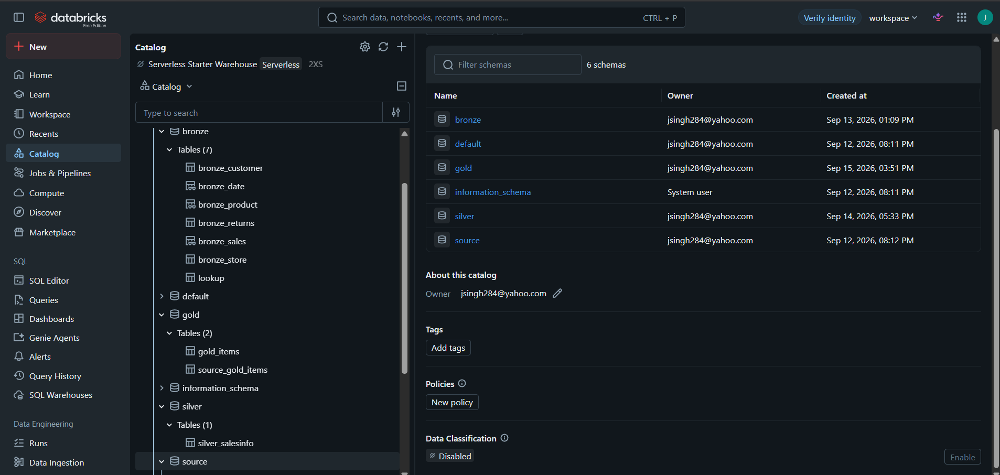

# 📚 Analytics Engineering Lab: Hands-On dbt Core & Databricks Masterclass

An end-to-end learning repository built to master modern analytics engineering practices using **dbt Core** on **Databricks**. This project demonstrates the practical application of modular SQL architecture, custom testing, reusable Jinja macros, slowly changing dimensions (Snapshots), and environment-aware data lineage.

---

## 📌 Learning Objectives & Key Concepts

This repository serves as a hands-on implementation of core dbt and analytics engineering concepts:

- **Medallion Data Architecture:** Transforming raw source systems into structured Bronze, Silver, and Gold data models.
- **Modular Lineage (`ref` & `source`):** Eliminating hardcoded table paths to enable dynamic environment routing and automated dependency DAG mapping.
- **Custom Data Quality Engineering:**
  - **Generic Tests:** Out-of-the-box constraints (`unique`, `not_null`, `accepted_values`).
  - **Singular Custom Tests:** One-off SQL assertions (`tests/*.sql`) to validate complex business rules like non-negative sales.
  - **Custom Generic Tests:** Reusable Jinja test macros applied dynamically across schema properties.
- **Jinja Templating & Macros:** Writing modular, reusable SQL functions (`multiply` macro) and standalone exploratory queries (`analyses/`).
- **Slowly Changing Dimensions (SCD Type 2):** Utilizing dbt Snapshots to capture historic changes over time using timestamp tracking (`updated_at`).
- **Seed Ingestion:** Loading version-controlled static reference files (`lookup.csv`) directly into the warehouse.

---

## 🏗 Pipeline Architecture & Data Lineage (DAG)

The project leverages dbt's dynamic `ref()` and `source()` functions to automatically generate a Directed Acyclic Graph (DAG), ensuring dependency order and tracking end-to-end data lineage across the Medallion Architecture layers.

### 1. Silver Model Transformation DAG

- **Data Flow:** External source tables (`dim_customer`, `dim_product`, `fact_sales`) pass through initial cleaning views (`bronze_customer`, `bronze_product`, `bronze_sales`) before joining into the consolidated `silver_salesinfo` table.


---

### 2. Gold Model & Snapshot DAG

- **Data Flow:** Raw `items` data flows into the `source_gold_items` model, which feeds directly into the `gold_items` snapshot model (`SCD Type 2`) to track historic record changes over time.


---

### 3. Databricks Catalog & Medallion Architecture Setup

The screenshot below confirms successful dbt model compilation and materialization across all Medallion layers (`bronze`, `silver`, `gold`, and `source`) inside the Databricks Catalog:



---

## 🛠 Tech Stack

- **Transformation & Testing Framework:** dbt Core (Jinja + SQL)
- **Cloud Data Platform:** Databricks SQL Warehouse
- **dbt Adapter:** `dbt-databricks`
- **Development Environment:** VS Code, PowerShell, Python 3.12+

---

## 📁 Project Structure

```text
dbt_tutorial_project/
├── analyses/       # Standalone ad-hoc SQL queries and Jinja experiments
├── macros/         # Reusable Jinja functions & custom generic test definitions
├── models/
│   ├── source/     # YAML declarations for external Databricks source tables
│   ├── bronze/     # Source-aligned data cleaning, casting, & generic tests
│   ├── silver/     # Business logic, KPI aggregations, and multi-table joins
│   └── gold/       # Final deduplicated, consumer-facing data marts
├── seeds/          # CSV reference files loaded directly into Bronze
├── snapshots/      # SCD Type 2 historic state tracking models
├── tests/          # Singular custom SQL data quality assertions
├── dbt_project.yml # Central dbt project configuration
└── profiles.yml    # Databricks target environment connections
```

---

## 🚀 Setup & Installation

### 1. Prerequisites

\*`uv` (Fast Python package & project manager)

- Python 3.12 or newer
- A Databricks SQL Warehouse
- Access to the `dbt_tutorial_dev` catalog and the source tables configured in `models/source/sources.yml`

* A Databricks Personal Access Token (PAT) or supported authentication method

### 2. Environment Setup

Using **`uv`** for fast environment creation and dependency management:

```powershell
# Create a virtual environment (specify Python version if needed, e.g., --python 3.12)
uv venv .venv

# Activate the virtual environment
.\.venv\Scripts\Activate.ps1

# Install project dependencies from requirements.txt (or pyproject.toml)
uv pip install -r requirements.txt

```

### 3. Configure Databricks Connection

1. Configure your target connection in `dbt_tutorial_project/profiles.yml`.
2. Provide your Databricks host, SQL Warehouse HTTP path, catalog, schema, and PAT token. _(Never commit personal credentials or tokens to Git; prefer local environment variables)._
3. Confirm required source tables (`fact_sales`, `fact_returns`, `dim_date`, `dim_product`, `dim_store`, `dim_customer`, `items`) exist in your source schema.

Validate connection and profile settings:

```powershell
dbt debug --project-dir dbt_tutorial_project --profiles-dir dbt_tutorial_project
```

---

## 💻 Execution Commands

Run these workflow steps from the repository root:

```powershell
# 1. Ingest reference seeds into the warehouse
dbt seed --project-dir dbt_tutorial_project --profiles-dir dbt_tutorial_project

# 2. Materialize snapshots (SCD Type 2)
dbt snapshot --project-dir dbt_tutorial_project --profiles-dir dbt_tutorial_project

# 3. Run and materialize models (Bronze -> Silver -> Gold)
dbt run --project-dir dbt_tutorial_project --profiles-dir dbt_tutorial_project

# 4. Execute all generic, custom generic, and singular SQL tests
dbt test --project-dir dbt_tutorial_project --profiles-dir dbt_tutorial_project

# Shortcut: Seed, snapshot, run, and test in a single execution
dbt build --project-dir dbt_tutorial_project --profiles-dir dbt_tutorial_project
```

### Useful Inspection Commands

```powershell
# List all resources in the dbt graph
dbt list --project-dir dbt_tutorial_project --profiles-dir dbt_tutorial_project

# Compile raw SQL models to target-rendered SQL in target/
dbt compile --project-dir dbt_tutorial_project --profiles-dir dbt_tutorial_project
```

---

## 📖 Key Takeaways & Reference Docs

- **dbt Docs:** [Official dbt Documentation](https://docs.getdbt.com/docs/introduction)
- **Databricks Connector:** [dbt-databricks Setup Guide](https://docs.getdbt.com/docs/core/connect-data-platform/databricks-setup)

---

## 👤 Author

- **Portfolio:** [Your GitHub Profile]
- **LinkedIn:** [Your LinkedIn Profile]
